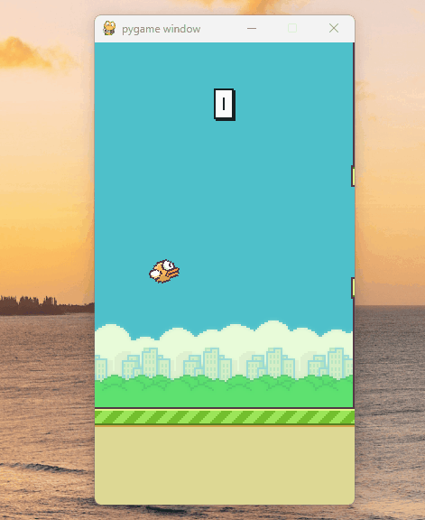
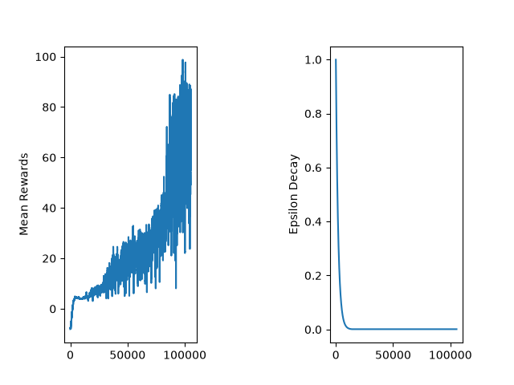

# Bird Flapping

# Flappy Bird
The game we all used to play on our chromebooks, is now being played by a computer. The bird moves through each pipe using a Deep Q Network. Combining reinforcement learning with deep neural networks, with 1 hour of training it can reach a level of 33. Clearing most people!

## How it works
A DQN agent learns to play Flappy bird from rewards, the training was first used as a plain double q learning. The issue with that is estimates are noisy while training, it dosen't take the truly best action. So we implement a double and dueling dqn. A double dqn splits two jobs across the two networks, the policy network selects the best next action and the target network is the actions value. This gives us the truly best reward, for example if we had estimates of 14,13,14,14,20, that true value should be 14 not 20. A dueling dqn splits into two streams then combines then, giving us faster more stable learning. We have a Value stream then our advantage stream, our Value streamestimates how good the state itself is, regardless of action. The advantage stream estimates how much better each action is relative to the average action in that state.

## Results

Here is the curve, on the left side you can see it climbing throughout on the graph. On the right we have a epsilon decay, it starts high and decays over training, so the agent gradually relies more on its learned strategy. In each episode we can see the rewards keeps climbing.The double and dueling improvements let it learn this well withtin about an hour, proves faster and more stable than a plain DQN would.

## How to run

In order to train the model, you need to run this command and let the agent learn
1: python agent.py flappybird1 --train

Then you can see how well the model trained and how far you can get
2: python agent.py flappybird1

## Attribution
Code Structure from Johnny Code, configured the hyperparameters in hp.yml. 

In this project I learned 
- What a DQN is
- Dueling and Double DQN
- Experience Replay
- Pytorch